Tsinghua-Berkeley Shenzhen Institute (TBSI) launched its inaugural Workshop on Data Science (TBSI-WODS) at Shenzhen Institute for Talents Development from December 17 to 19. The 3-day workshop featured keynote speeches, invited talks, discussions and competitions on the theme of data science theories and applications, bringing in renowned researchers from universities such as Princeton, Yale, University of California at Berkeley, University of California at San Diego, University of Texas at Austin, University of Toronto, Carnegie Mellon University, and Georgia Institute of Technology. Current TBSI masters and PhD students also showcased their research in the “Boffin Talks” Student Research Competition and tested their data analysis skills at the Night Owl AI Hackathon.

On morning of Dec. 17th, professor Shao-lun Huang hosted the workshop opening and introduced the goal of TBSI WODS to audiences. The goal of WODS is to focus on the discussion of scientific research itself and the Industry-University-Research Integration.

After the opening ceremony, professor Stark Draper from University of Toronto gave a keynote speech on “Large Scale Linear Programming Decoding via the Alternating Direction Method of Multipliers”.

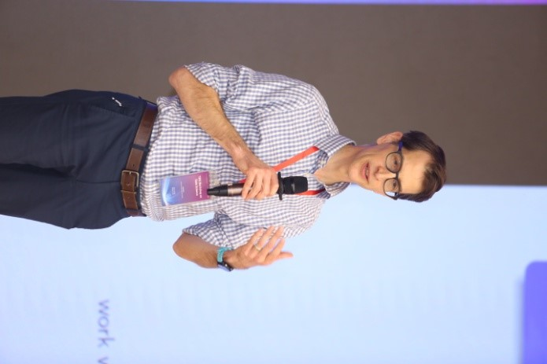

After the keynote speech, another three young scholars gave presentations on Data Science and Optimization theories. The first speaker was associate professor Yuejie Chi from Carnegie Mellon University, who presented her work on “Communication-Efficient Distributed Stochastic Optimization with Variance Reduction and Gradient Tracking”. Yuxin Chen, assistant professor from Princeton University, presented his work on “Nonconvex Optimization Meets Statistics: A Few Recent Stories”. Finally, associate professor Yihong Wu from Yale University made a speech on the topic “Spectral Graph Matching and Regularized Quadratic Relaxations”. 

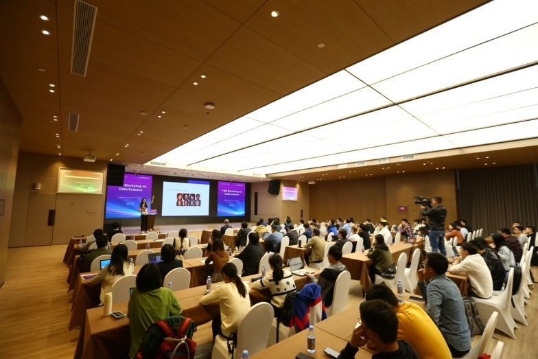

On Dec. 17th afternoon, invited speakers and TBSI hosts joined in the workshop committee meeting to brainstorm future TBSI workshops on learning theory and data science. The RATO forum was held immediately afterwards, where guests discussed the application of AI in the manufacturing industry with RATO representatives. The last event of the day was an open panel discussion, where professor Ercan E. Kuruoglu, Stark Draper, Qixing Huang and Yao Xie shared their thoughts on emerging topics such as the future of AI and autonomous driving. Then they also gave advices on issues students concern about, such as how to publish a high-quality paper, how to determine your own research direction, and which courses are most important for prospective data scientists.

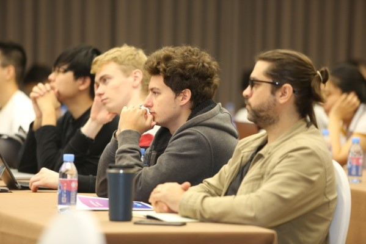

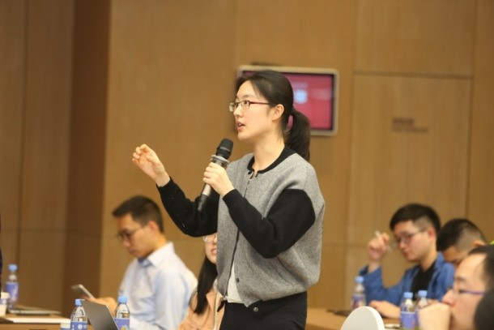

On Dec 18th morning, professor Xin Guo, from University of California, Berkeley made a keynote speech on “Mean Field Games, GANs and Learning”. Then assistant professor Hao Su from UC San Diego made a presentation on the topic “Learning to Model the Environment for Interaction”. After that, assistant professor Qixing Huang from University of Texas at Austin gave a speech about “Geometry Learning under Hybrid 3D Representations”. The last speaker of this morning was Yang Li, an assistant professor from TBSI giving a speech on “Using Maximal Correlation for Task Transferability Estimation and Multi-View Learning”.

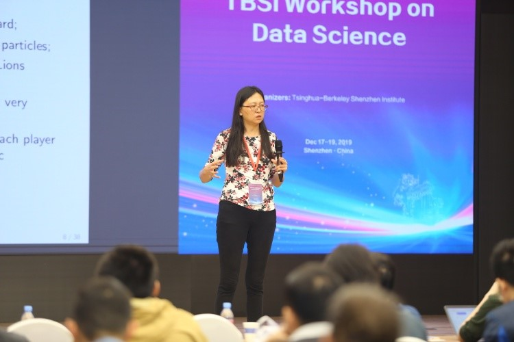

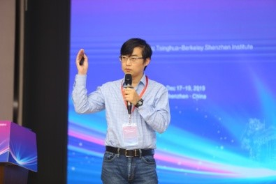

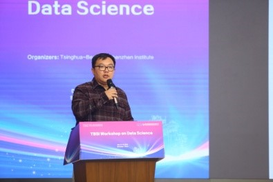

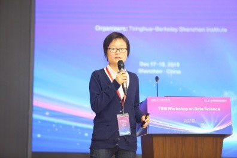

On Dec. 18th afternoon, the Student Research Competition began. The competition was divided into three sessions based on research themes and the first two were scheduled for this afternoon. The first session was about “Machine Learning and Optimization”, while the second was about “Applications in AI, Smart City and Social Science”. During each session,  six students gave 15-minute presentations about their work and answered questions from judges and the audience.

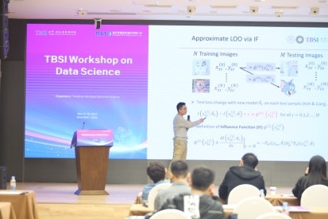

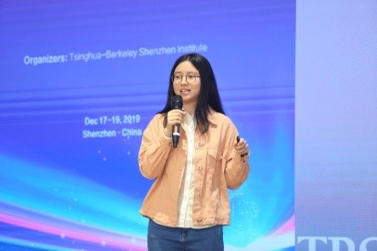

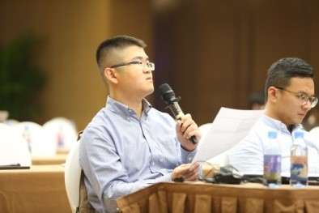

On of Dec. 19th morning, Ercan E. Kuruoglu, a visiting professor at TBSI, gave a keynote speech titled “Time-varying Graph Modelling Using Sequential Monte Carlo”. After a coffee break, assistant professor Yao Xie from Georgia Institute of Technology, gave a presentation on “Distributional Robust Hypothesis Testing with Wasserstein Uncertainty Sets”. Next, assistant professor Min Ye from TBSI gave a presentation on “Arikan meets Shannon: Polar codes with near-optimal convergence to channel capacity”. Finally, Yuting Wei, an assistant professor from Carnegie Mellon University, presented her work on “Towards a better understanding of the regularization in kernel learning”.

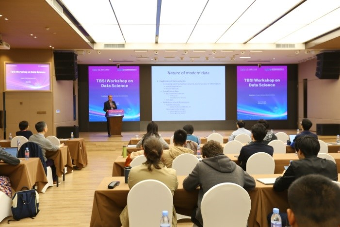

In the afternoon, the third session of Student Research Competition began, and the theme was “Applications in Health and Energy”. Four students from three groups showcased their work. At around 3:00pm, professor Yang Li announced the winners of the Student Research. Alberto Pepe won the Best Presentation Award. Mingyang Liu and Yuanxiong Cao won the Best Interdisciplinary Award. The first, second and third places of the Best Student Research Award was presented to Guodong Li, Zifeng Wang and Yiming Li, respectively.

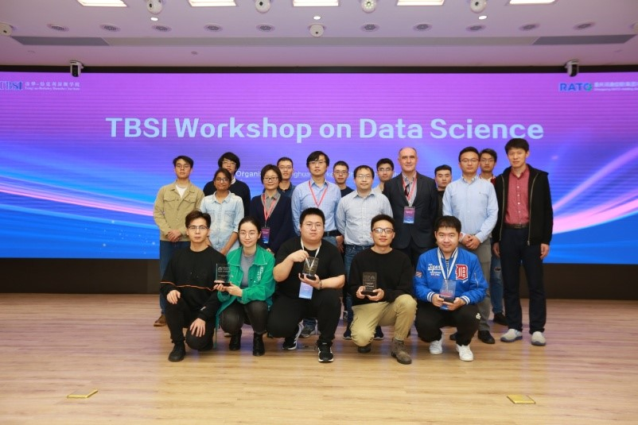

On 20th December, 8pm, the first ever over-night hackathon NOAH (Night Owl AI Hackathon) of WODS began. This 12-hour hackathon saw eight teams of 22 students compete to analyse and deliver their most interesting insights from three given datasets. The next day morning, at 10:30 am, the teams presented their works to the panel of judges. After the presentations, three teams were announced as winners: 3rd place: Happy Owl (Members: Wenjie Zhang, David A. Cecchini, Yi Zhang), 2nd place: Plain Yogurt (Members: Juting Wang, Mengxuan Chen, Lee Junyoung) and 1st place: GuaiWeiHuDou (Members: LiangCheng Xu, Junlin Guo, Chenxi Cheng). NOAH was an initiative by the students of the organizing committee, right from the idea, problem design, prize selection to the conductance of the event. The credit goes to members Shivaranjani, Yiming Li, Ma Fei, Alan and others of the WODS committee. The whole idea of featuring student competitions such as BoffinTalks and NOAH at WODS was to encourage student participation, not only as the audience, but as contributors, utilizing this as platform to show case their analytics and research talents.

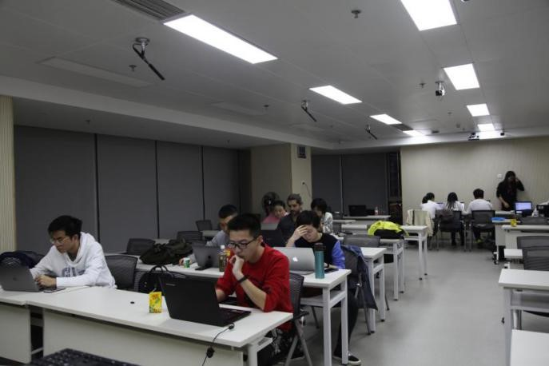

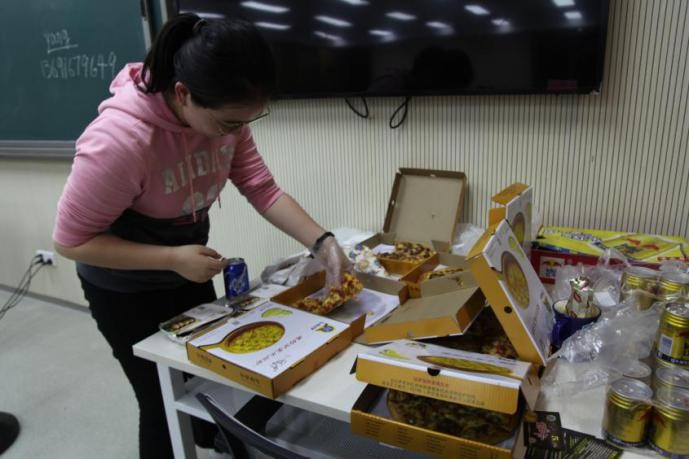

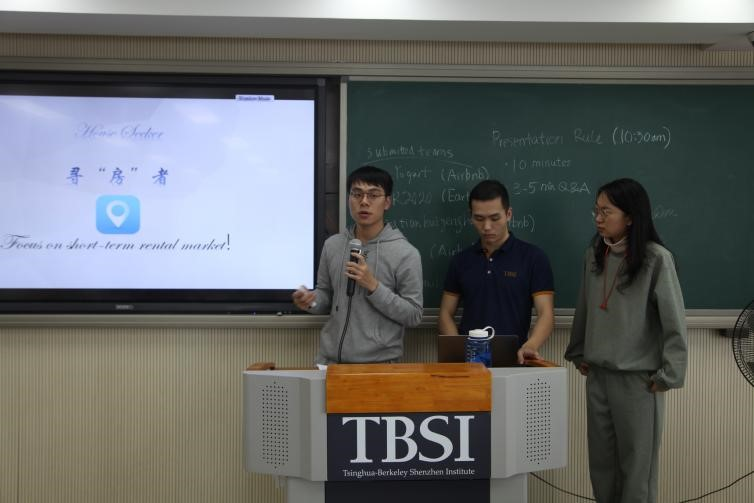

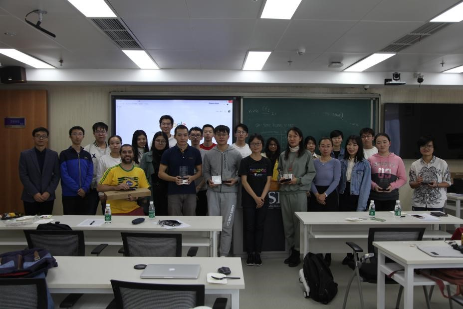

